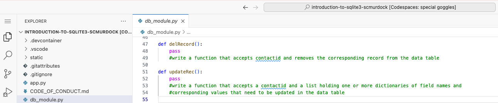

# Career Connections: Using a Database

## What You Need To Know
If you haven't read and understood the required reading A Peek at Databases from earlier in this module, go back and do so now. You will be unable to complete this assignment without that knowledge.

You will need to know the Three Cs for creating a table within a database, what CRUD is, and how to perform each component. 

You will need to know what a primary key is and how to store and access information in a dictionary.

## GitHub Classroom
An assignment with starter code has been loaded in GitHub Classroom. It consists of a series of methods (i.e., functions) that are used to create a database, create a table in a given database, and create a record within a given table. To help you complete it, I have created a video review of the concepts you will need to understand: [Code Walk-through Video](https://players.brightcove.net/1699278547001/fSxeykeCHG_default/index.html?videoId=6363511807112.)(19:42).

The repository you will access holds a Python file named `db_module.py`. That Python program defines and uses a series of methods (i.e., functions) to create a database and create a table named contacts inside that database. The code then adds three records to the contacts table using a method called `insertRow()`. It then uses a `getRecord()` method to extract various records from the table using different "where" clauses. Each line in the sample code is commented on. I encourage you to read and understand those comments.

Study the flow of the code and understand how it does what it does. You may refer back to the A Peek at Databases reading to help you understand the code. Experiment with it and work toward fully understanding it.

In summary, the sample code performs C (Inserts three records) and R (Reads all, then reads some, of the records in the table), but leaves it to you to write the U (Update) and the D (Delete). The objective here is to become proficient in CRUD: Create, Read, Update, and Delete. Doing so will provide you with a solid foundation as a database developer!

## Your Task
Once you understand how the code works, you can add your own to complete the CRUD quartet. This is a skill proficient database programmers have.

See below. You will complete a function that will update a particular record. This function will receive a dictionary that contains the following: a database name, a table name, the name of a primary key field, the value of the primary key for the record you are updating, the name of the field you want to update, and the new value that field will have once updated. Can you sketch the structure of this dictionary? Can you write a function that takes such a dictionary and extracts from it each element? If not, please review [Python Dictionaries](https://www.w3schools.com/python/python_dictionaries.asp) from the Required Reading in Week 2: Programming Basics.

Your second task will be to complete CRUD by deleting a specific record (row) from a table. The function you complete will receive, as a parameter, a dictionary containing a database name, a table name, the name of a primary key field, and the value of the primary key for the record you want to delete. The function body will accomplish this deletion.
